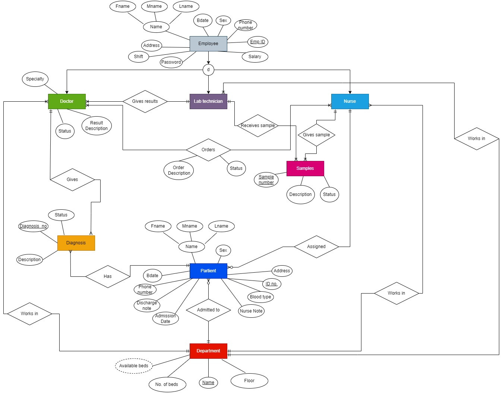
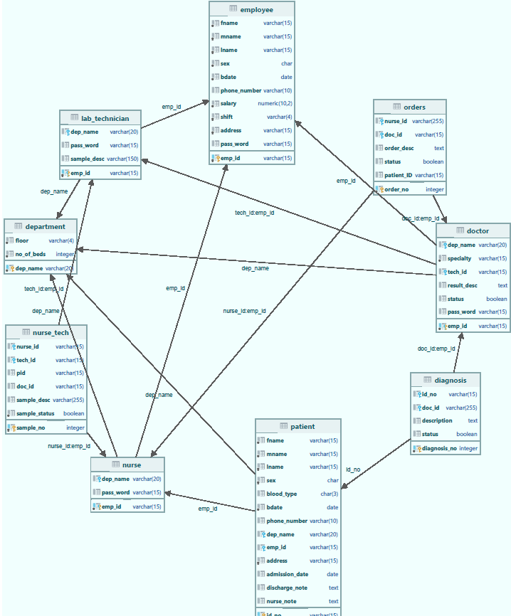

# Hospital Management System

A comprehensive database project for managing a small-scale hospital with a JavaSwing user interface. The system helps in managing hospital resources, staff, patients, and various medical processes.


## Project Overview

This Hospital Management System provides an integrated solution for managing all aspects of a hospital's operations. It handles data for employees (doctors, nurses, lab technicians), patients, departments, medical samples, diagnoses, and more.

## Database Schema

The system is built around the following key entities:

- **Department**: Manages hospital departments, floors, and bed availability
- **Employee**: Core entity for all staff with common attributes
- **Doctor**: Medical professionals with specializations who diagnose patients
- **Nurse**: Medical staff responsible for patient care and order administration
- **Lab Technician**: Specialized staff handling medical samples and tests
- **Patient**: Contains all patient demographic and medical information
- **Orders**: Tracks medical orders from doctors to nurses
- **Diagnosis**: Records patient diagnoses made by doctors
- **Samples**: Manages laboratory samples and their status

### Entity Relationship Diagram



### UML Class Diagram



## Project Structure

```
Hospital-Management-System/
├── Database/            # SQL scripts for database creation and management
│   └── DDL.sql          # Data Definition Language for database tables
├── docs/                # Documentation files
│   ├── Department Information Jasper Report.pdf
│   ├── Discharge Patient Jasper Report.pdf
│   ├── Hospital Project Documentaion.pdf
│   └── Lab Technician Jasper Report.pdf
├── images/              # Project images and diagrams
│   ├── Background.png
│   ├── Logo.png
│   ├── Project(UML).png
│   ├── ProjectCrows_foot.jpg
│   └── UML_Diagram.png
└── src/                 # Source code for the Java application
    ├── *.form           # JavaSwing form files
    └── *.java           # Java implementation files
```

## Features

- User authentication and role-based access control
- Department management (adding, editing, viewing)
- Employee management for doctors, nurses, and lab technicians
- Patient registration and management
- Medical orders processing
- Sample collection and tracking
- Diagnostic reporting
- Discharge processing

## Implementation Details

The system is implemented using:

- Java Swing for the user interface
- PostgreSQL for the database
- Jasper Reports for generating reports

## User Interface

The application provides intuitive interfaces for:

- Login and authentication
- Patient management
- Department administration
- Diagnostic processes
- Laboratory workflows
- Patient discharge

## Reports

The system generates various reports using Jasper Reports:

- [Department Information Report](docs/Department%20Information%20Jasper%20Report.pdf)
- [Discharge Patient Report](docs/Discharge%20Patient%20Jasper%20Report.pdf)
- [Lab Technician Report](docs/Lab%20Technician%20Jasper%20Report.pdf)

## Documentation

For complete details about the system architecture, database design, implementation details, and user manual, please refer to the [Hospital Project Documentation](docs/Hospital%20Project%20Documentaion.pdf).

## Screenshots


## Getting Started

1. Clone the repository
2. Import the database schema from `Database/DDL.sql`
3. Open the project in your Java IDE
4. Run the application from `src/Project.java`

## Requirements

- Java JDK 8 or higher
- PostgreSQL
- JasperReports library
